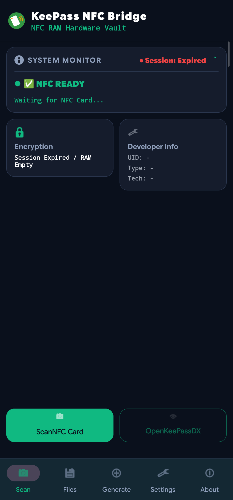
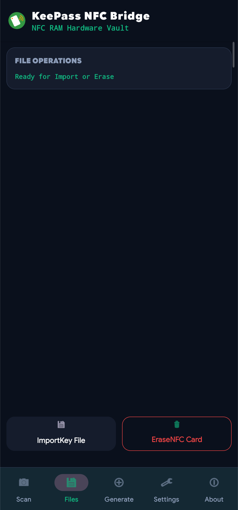
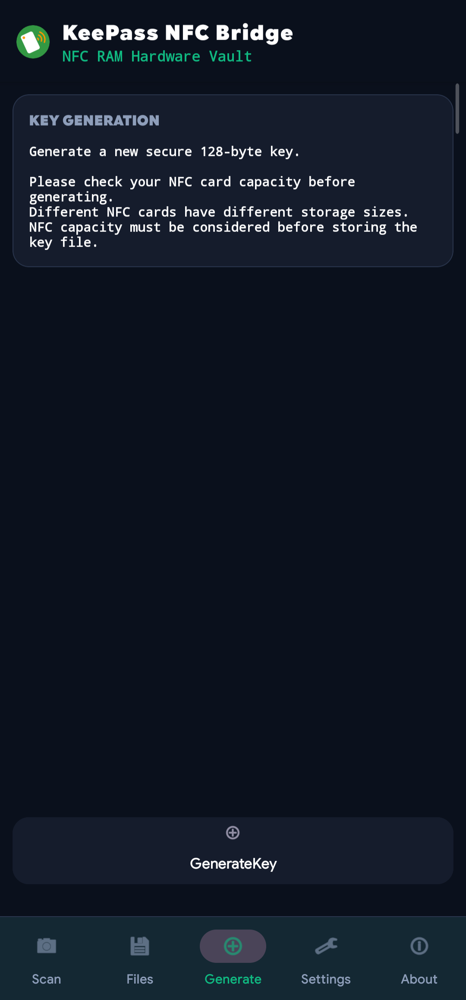
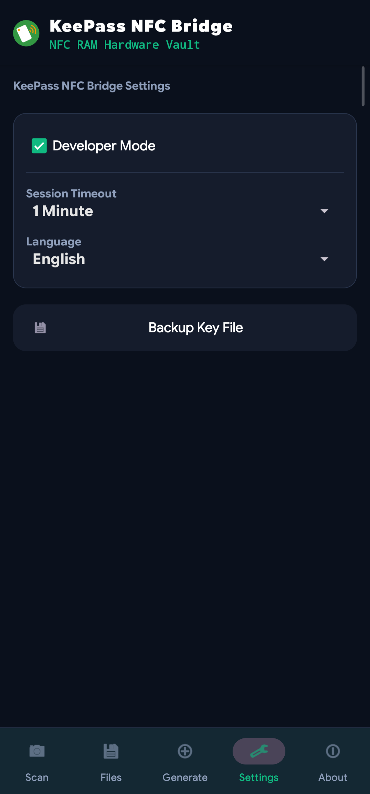
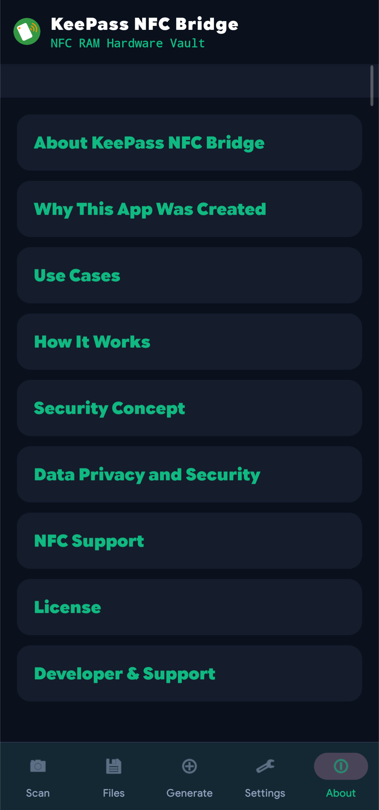

# KeePass NFC Bridge

Android NFC bridge application for KeePassDX key file workflow with secure temporary RAM session.

## Overview

KeePass NFC Bridge is an Android application designed to connect NFC key storage with KeePassDX.

The application provides a secure offline workflow where key files are handled temporarily in memory (RAM) during the authentication process.

## Features

- NFC key file bridge for KeePassDX
- Key file generation and management
- NFC read/write support
- Temporary RAM session handling
- Offline-first security workflow
- Android Kotlin source release

## How It Works

NFC Card 

   ↓ 
   
KeePass NFC Bridge 

   ↓ 
   
Temporary RAM Session 

   ↓ 
   
KeePassDX 

## Demo Video

Watch the KeePass NFC Bridge v1.0 demonstration:

## Roadmap

### v1.0 - Core Bridge
✅ NFC read/write support  
✅ Key file management  
✅ KeePassDX workflow foundation  
✅ Temporary RAM session system  

### v1.5 - Improvements (Planned)
🔄 UI polishing  
🔄 More detailed application information  
🔄 Improved NFC tap workflow  

### v2.0 - Secure NFC Layer (Planned)
🔒 NFC DNA integration  
🔒 Secure card authentication  
🔒 Protection against raw card reading  

## Screenshots

<table>
<tr>
<td align="center">
 
Scan NFC
</td>

<td align="center">
 
Import Key
</td>

<td align="center">
 
Generate Key
</td>
</tr>

<tr>
<td align="center">
 
Settings
</td>

<td align="center">
 
About
</td>

<td align="center">
 
App Icon
</td>
</tr>
</table>

## Download

Latest APK:
- GitHub Releases: https://github.com/miftahdhe/KeePass-NFC-Bridge/releases

Source Code:
- Available in this repository

## License

GPL-3.0 License
